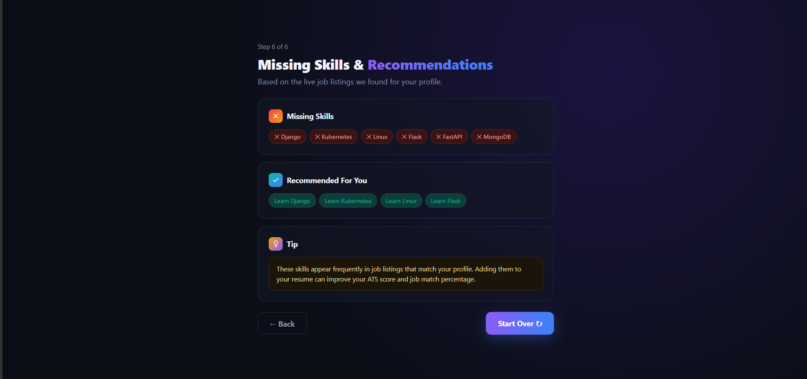
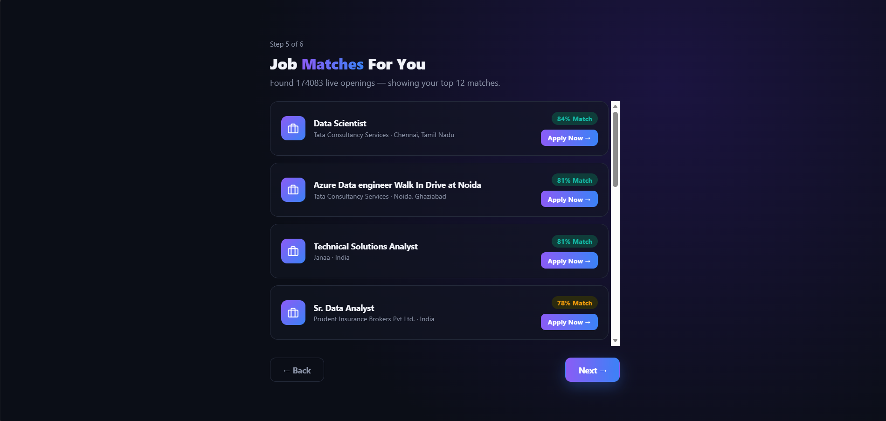
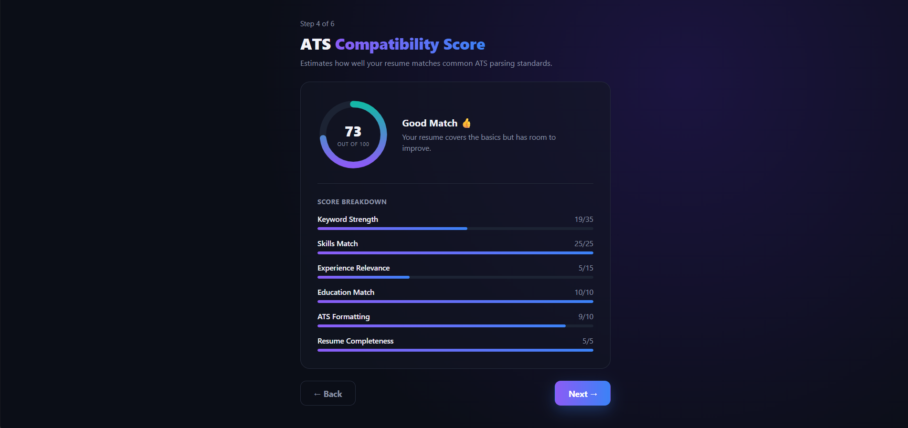
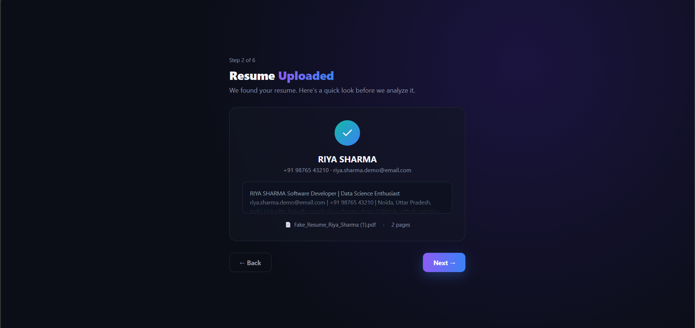
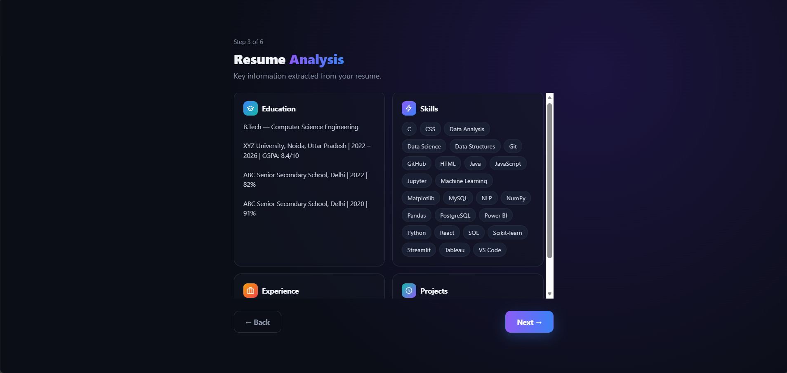
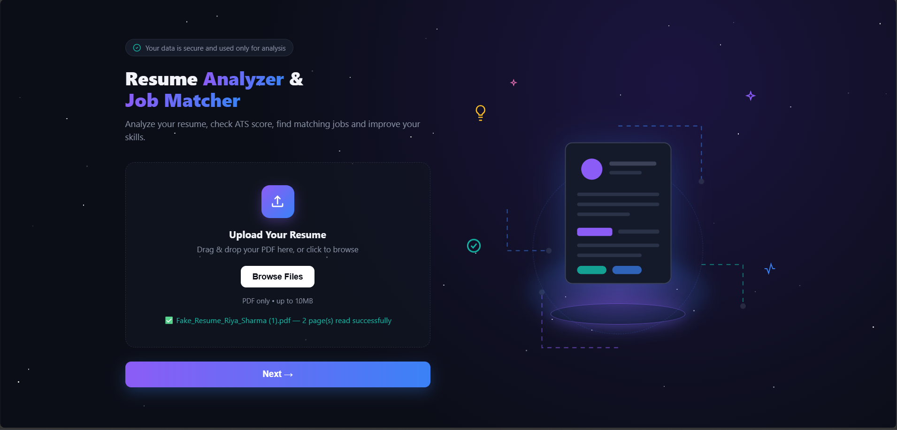

# 📄 Resume Analyzer & Job Matcher

Analyze your resume, check your ATS compatibility score, discover real matching jobs, and find out which skills to learn next — all in one simple 6-step flow.

---

## ✨ Features

- **PDF Resume Upload** — strict validation ensures only genuine, readable PDF resumes are accepted
- **Automatic Resume Parsing** — extracts Skills, Education, Experience, and Projects using rule-based NLP
- **ATS Compatibility Score** — a 6-category weighted score (Keyword Strength, Skills Match, Experience Relevance, Education Match, ATS Formatting, Resume Completeness) inspired by real ATS/resume-checker tools
- **Live Job Matching** — fetches real, currently-open job listings from the [Adzuna API](https://developer.adzuna.com/), with genuine apply links
- **Missing Skills & Recommendations** — compares your resume's skills against in-demand skills from live job listings to suggest what to learn next

---

## 🖼️ Screenshots

>     

---

## 🛠️ Tech Stack

**Frontend:** HTML, CSS, Vanilla JavaScript (no framework — kept lightweight and dependency-free)
**Backend:** Python, FastAPI
**PDF Parsing:** pdfplumber
**Job Data:** Adzuna Job Search API

---

## 📁 Project Structure

```
resume-analyzer-job-matcher/
├── index.html          # Slide 1 - Upload
├── slide2.html          # Slide 2 - Upload confirmation
├── slide3.html          # Slide 3 - Resume analysis
├── slide4.html          # Slide 4 - ATS score
├── slide5.html          # Slide 5 - Job matches
├── slide6.html          # Slide 6 - Missing skills & recommendations
└── backend/
    ├── main.py           # FastAPI server: parsing, scoring, job matching
    ├── .env              # API keys (not committed to Git)
    └── .gitignore
```

---

## 🚀 Running Locally

### 1. Backend setup

```bash
cd backend
pip install fastapi uvicorn python-multipart pdfplumber requests python-dotenv
```

Create a `.env` file inside `backend/` with your own free [Adzuna API](https://developer.adzuna.com/) credentials:

```
ADZUNA_APP_ID = "dbca915e"
ADZUNA_APP_KEY = "ce2d3986f6b4415f468328de2704a9b1"
```

Start the backend:

```bash
python -m uvicorn main:app
```

The backend runs at `http://127.0.0.1:8000`.

### 2. Frontend setup

Open `index.html` with a local server (e.g. VS Code's **Live Server** extension) — opening it directly as a `file://` URL will not work, since the page needs to talk to the backend over HTTP.

---

## ⚠️ Notes & Limitations

- The ATS score is a **heuristic estimate**, not an official or universal ATS formula — no such single standard exists even among commercial tools (Jobscan, Enhancv, Zety all score differently from each other too).
- Resume parsing uses rule-based pattern matching (regex + keyword detection), so unusual resume formats may parse imperfectly.
- Job listings are sourced live from Adzuna's free tier and are limited to India-based roles by default.

---

## 👤 Author

Built by **Ayushi Tyagi** as a personal/academic project.
